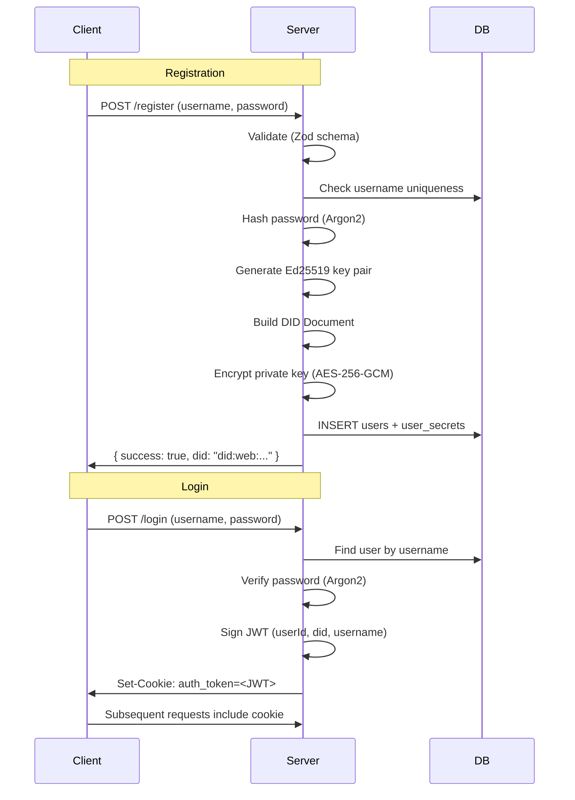

# Authentication Endpoints

> Covers **Epic 1** — User Stories 1.1 (Account Creation) and 1.4 (Secure Authentication).

---

## Overview

PolyVerse uses **form-action** based authentication through SvelteKit's `+page.server.ts` handlers. On registration, a cryptographic `did:web` identity is generated. On login, a JWT is issued and stored in an HttpOnly cookie.

### Auth Flow



---

## POST `/register`

**Epic Ref:** Task 1.1.1, 1.1.2  
**File:** [`+page.server.ts`](file:///home/ks/Desktop/projects/polyverse/src/routes/register/+page.server.ts)  
**Auth Required:** No

Creates a new user account with a cryptographic DID identity.

### Request

Form-encoded (`multipart/form-data`):

| Field      | Type   | Required | Constraints                                                                                     |
| ---------- | ------ | -------- | ----------------------------------------------------------------------------------------------- |
| `username` | string | Yes      | Min 5 chars, alphanumeric + underscores only (`/^[a-zA-Z0-9_]+$/`)                             |
| `password` | string | Yes      | Min 8 chars, at least 1 uppercase, 1 number, 1 special char (`!@#$%^&*-+`)                     |

### Processing

1. **Validate** input via Zod schema
2. **Check** username uniqueness in database
3. **Hash** password with Argon2
4. **Generate** Ed25519 key pair using `jose`
5. **Build** W3C DID Document (`did:web:{domain}:u:{username}`) with `JsonWebKey2020` verification method
6. **Encrypt** private key using AES-256-GCM
7. **Insert** user record into `users` table
8. **Insert** encrypted private key into `user_secrets` table

### Responses

**200 — Success**
```json
{
  "success": true,
  "did": "did:web:polyverse.social:u:alice"
}
```

**400 — Validation Error**
```json
{
  "errors": {
    "username": ["Username must be at least 5 characters"],
    "password": ["Password must contain at least one uppercase letter"]
  }
}
```

**409 — Username Taken**
```json
{
  "errors": "Username already taken"
}
```

**500 — Server Error**
```json
{
  "errors": "Internal Server Error"
}
```

### Generated DID Document Structure

```json
{
  "@context": [
    "https://www.w3.org/ns/did/v1",
    "https://w3id.org/security/suites/jws-2020/v1"
  ],
  "id": "did:web:polyverse.social:u:alice",
  "verificationMethod": [
    {
      "id": "did:web:polyverse.social:u:alice#owner",
      "type": "JsonWebKey2020",
      "controller": "did:web:polyverse.social:u:alice",
      "publicKeyJwk": { "kty": "OKP", "crv": "Ed25519", "x": "..." }
    }
  ],
  "authentication": ["did:web:polyverse.social:u:alice#owner"],
  "assertionMethod": ["did:web:polyverse.social:u:alice#owner"]
}
```

---

## POST `/login`

**Epic Ref:** Task 1.4.1  
**File:** [`+page.server.ts`](file:///home/ks/Desktop/projects/polyverse/src/routes/login/+page.server.ts)  
**Auth Required:** No

Authenticates a user and issues a JWT via HttpOnly cookie.

### Request

Form-encoded (`multipart/form-data`):

| Field      | Type   | Required |
| ---------- | ------ | -------- |
| `username` | string | Yes      |
| `password` | string | Yes      |

### Processing

1. **Find** user by username
2. **Verify** password against Argon2 hash
3. **Extract** DID from stored DID document
4. **Create** JWT with payload: `{ userId, did, username }`
5. **Set** `auth_token` HttpOnly cookie (7-day expiry, lax SameSite)
6. **Redirect** to `/profile` (302)

### Responses

**302 — Success** → Redirect to `/profile` with `Set-Cookie` header

**400 — Missing Fields**
```json
{
  "error": "Username and password are required"
}
```

**401 — Invalid Credentials**
```json
{
  "error": "Invalid username or password"
}
```

> [!NOTE]
> The error message is intentionally generic (`"Invalid username or password"`) to prevent username enumeration attacks (Task 1.4.4).

### JWT Payload

```json
{
  "userId": "550e8400-e29b-41d4-a716-446655440000",
  "did": "did:web:polyverse.social:u:alice",
  "username": "alice",
  "iat": 1700000000,
  "exp": 1700604800
}
```

### Cookie Configuration

| Property   | Value                                |
| ---------- | ------------------------------------ |
| Name       | `auth_token`                         |
| Path       | `/`                                  |
| HttpOnly   | `true`                               |
| Secure     | `true` (production) / `false` (dev)  |
| SameSite   | `lax`                                |
| Max-Age    | 604800 (7 days)                      |

---

## GET `/logout`

**Epic Ref:** Part of Task 1.4  
**File:** [`+page.server.ts`](file:///home/ks/Desktop/projects/polyverse/src/routes/logout/+page.server.ts)  
**Auth Required:** No

Clears the authentication cookie and redirects to the home page.

### Processing

1. **Delete** `auth_token` cookie
2. **Redirect** to `/` (302)

### Response

**302** → Redirect to `/` with cookie deletion header

> [!TIP]
> Both `GET` (load function) and `POST` (form action) methods are supported, so the logout works via both direct navigation and form submission.

---

## Authentication Middleware

**Epic Ref:** Task 1.4.5  
**File:** [`hooks.server.ts`](file:///home/ks/Desktop/projects/polyverse/src/hooks.server.ts)

The server hook runs on **every** request and:

1. Initializes `event.locals.user = null`
2. Reads the `auth_token` cookie
3. If present, verifies the JWT using the `JWT_SECRET`
4. On success, sets `locals.user = { userId, did, username }`
5. On failure (invalid/expired token), clears the cookie

Protected endpoints check `locals.user` and throw **401 Unauthorized** if `null`.
