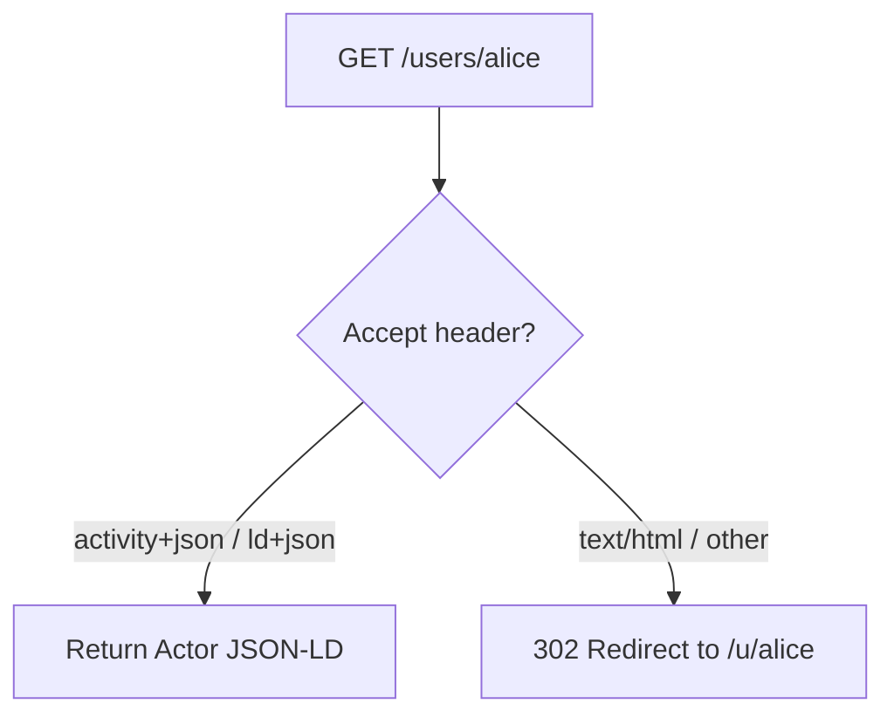

# Identity & Discovery Endpoints

> Covers **Epic 1** — User Stories 1.1 (DID Resolution), 1.2 (WebFinger), and 1.3 (Actor Profile).

These endpoints make PolyVerse discoverable by the broader Fediverse. They are all **unauthenticated** and publicly accessible.

---

## GET `/u/{username}/did.json`

**Epic Ref:** Task 1.1.5  
**File:** [`+server.ts`](file:///home/ks/Desktop/projects/polyverse/src/routes/u/[username]/did.json/+server.ts)  
**Auth Required:** No

Serves the user's W3C DID Document. This is the resolution endpoint for `did:web:{domain}:u:{username}`.

### Path Parameters

| Parameter  | Type   | Description         |
| ---------- | ------ | ------------------- |
| `username` | string | The user's username |

### Response Headers

```
Content-Type: application/did+ld+json
```

### 200 — DID Document

```json
{
  "@context": [
    "https://www.w3.org/ns/did/v1",
    "https://w3id.org/security/suites/jws-2020/v1"
  ],
  "id": "did:web:polyverse.social:u:alice",
  "verificationMethod": [
    {
      "id": "did:web:polyverse.social:u:alice#owner",
      "type": "JsonWebKey2020",
      "controller": "did:web:polyverse.social:u:alice",
      "publicKeyJwk": {
        "kty": "OKP",
        "crv": "Ed25519",
        "x": "..."
      }
    }
  ],
  "authentication": ["did:web:polyverse.social:u:alice#owner"],
  "assertionMethod": ["did:web:polyverse.social:u:alice#owner"]
}
```

### Errors

| Code | Condition               |
| ---- | ----------------------- |
| 404  | User not found          |

---

## GET `/webfinger`

**Epic Ref:** Tasks 1.2.1, 1.2.2  
**File:** [`+server.ts`](file:///home/ks/Desktop/projects/polyverse/src/routes/webfinger/+server.ts)  
**Auth Required:** No

Implements [RFC 7033 WebFinger](https://datatracker.ietf.org/doc/html/rfc7033). Allows external Fediverse instances (e.g., Mastodon) to discover the ActivityPub Actor URL for a given handle.

> [!NOTE]
> The actual route path is `/webfinger`, not `/.well-known/webfinger`. Typically a reverse proxy or hosting config rewrites `/.well-known/webfinger` to this route.

### Query Parameters

| Parameter  | Type   | Required | Format                   | Example                         |
| ---------- | ------ | -------- | ------------------------ | ------------------------------- |
| `resource` | string | Yes      | `acct:{username}@{domain}` | `acct:alice@polyverse.social`   |

### Processing

1. **Parse** `resource` parameter — extract username and domain
2. **Validate** domain matches the server's `DOMAIN` env variable
3. **Lookup** user in database by username
4. **Return** JRD response with links to the Actor URL

### Response Headers

```
Content-Type: application/jrd+json
```

### 200 — JRD Response

```json
{
  "subject": "acct:alice@polyverse.social",
  "links": [
    {
      "rel": "self",
      "type": "application/activity+json",
      "href": "https://polyverse.social/users/alice"
    },
    {
      "rel": "http://webfinger.net/rel/profile-page",
      "type": "text/html",
      "href": "https://polyverse.social/users/alice"
    }
  ]
}
```

### Errors

| Code | Condition                                               |
| ---- | ------------------------------------------------------- |
| 400  | Missing/invalid `resource` param or domain mismatch     |
| 404  | User not found                                          |

---

## GET `/users/{username}`

**Epic Ref:** Tasks 1.3.1, 1.3.2, 1.3.3, 1.5.3  
**File:** [`+server.ts`](file:///home/ks/Desktop/projects/polyverse/src/routes/users/[username]/+server.ts)  
**Auth Required:** No

The Actor endpoint with **content negotiation**:

- **ActivityPub request** (`Accept: application/activity+json` or `application/ld+json`) → returns Actor JSON-LD
- **Browser request** (`Accept: text/html`) → redirects to `/u/{username}` (HTML profile page)

### Path Parameters

| Parameter  | Type   | Description         |
| ---------- | ------ | ------------------- |
| `username` | string | The user's username |

### Content Negotiation



### Response Headers (ActivityPub)

```
Content-Type: application/activity+json; charset=utf-8
```

### 200 — Actor Object

```json
{
  "@context": [
    "https://www.w3.org/ns/activitystreams",
    "https://w3id.org/security/v1"
  ],
  "id": "https://polyverse.social/users/alice",
  "type": "Person",
  "preferredUsername": "alice",
  "name": "Alice Smith",
  "summary": "Hello, I'm Alice!",
  "inbox": "https://polyverse.social/users/alice/inbox",
  "outbox": "https://polyverse.social/users/alice/outbox",
  "followers": "https://polyverse.social/users/alice/followers",
  "following": "https://polyverse.social/users/alice/following",
  "icon": {
    "type": "Image",
    "mediaType": "image/jpeg",
    "url": "https://blob.vercel-storage.com/avatars/..."
  },
  "publicKey": {
    "id": "https://polyverse.social/users/alice#main-key",
    "owner": "https://polyverse.social/users/alice",
    "publicKeyJwk": {
      "kty": "OKP",
      "crv": "Ed25519",
      "x": "..."
    }
  },
  "alsoKnownAs": ["did:web:polyverse.social:u:alice"]
}
```

### Field Details

| Field              | Source                    | Always Present | Description                                     |
| ------------------ | ------------------------ | -------------- | ----------------------------------------------- |
| `id`               | Constructed              | Yes            | `https://{DOMAIN}/users/{username}`              |
| `type`             | Static                   | Yes            | Always `"Person"`                                |
| `preferredUsername` | `users.username`         | Yes            | The handle                                       |
| `name`             | `users.displayName`      | No             | Display name (omitted if null)                   |
| `summary`          | `users.bio`              | No             | Bio (omitted if null)                            |
| `inbox`            | Constructed              | Yes            | `{id}/inbox`                                     |
| `outbox`           | Constructed              | Yes            | `{id}/outbox`                                    |
| `followers`        | Constructed              | Yes            | `{id}/followers`                                 |
| `following`        | Constructed              | Yes            | `{id}/following`                                 |
| `icon`             | `users.avatarUrl`        | No             | Image object with `type`, `mediaType`, `url`     |
| `publicKey`        | `users.didDocument`      | Conditional    | Present if DID document has a verification method |
| `alsoKnownAs`      | `users.didDocument.id`   | Yes            | Links to the DID identifier                      |

### Errors

| Code | Condition      |
| ---- | -------------- |
| 404  | User not found |
