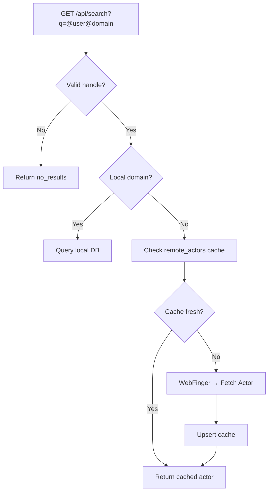

# Search & Remote User Lookup

> Covers **Epic 3** — User Story 3.1 (Remote User Lookup), Tasks 3.1.2, 3.1.3, 3.1.4.

---

## GET `/api/search`

**File:** [`+server.ts`](file:///home/ks/Desktop/projects/polyverse/src/routes/api/search/+server.ts)  
**Auth Required:** Yes

Searches for users by Fediverse handle pattern (`@user@domain`). Supports both local database lookup and remote WebFinger + Actor resolution with caching.

This endpoint is the frontend-facing API for **Epic 3 User Story 3.1** (Remote User Lookup). The underlying federation logic is provided by the [`federation.ts`](file:///home/ks/Desktop/projects/polyverse/src/lib/server/federation.ts) service module.

### Query Parameters

| Parameter | Type   | Required | Format              | Example                      |
| --------- | ------ | -------- | ------------------- | ---------------------------- |
| `q`       | string | Yes      | `@user@domain` or `user@domain` | `@gargron@mastodon.social`  |

### Search Flow



### Response Types

#### `no_results` — Query not a valid handle

```json
{
  "type": "no_results",
  "query": "random search text",
  "message": "Search term does not match a Fediverse handle pattern (@user@domain). Try using the full handle."
}
```

#### `local_user` — Found on this instance

```json
{
  "type": "local_user",
  "user": {
    "username": "alice",
    "displayName": "Alice Smith",
    "bio": "Hello!",
    "avatarUrl": "https://blob.vercel-storage.com/avatars/...",
    "profileUrl": "/u/alice"
  }
}
```

#### `remote_actor` — Resolved from another instance

```json
{
  "type": "remote_actor",
  "actor": {
    "id": "https://mastodon.social/users/Gargron",
    "type": "Person",
    "preferredUsername": "Gargron",
    "name": "Eugen Rochko",
    "summary": "Founder of Mastodon",
    "icon": { "type": "Image", "url": "..." },
    "url": "https://mastodon.social/@Gargron",
    "inbox": "https://mastodon.social/users/Gargron/inbox",
    "outbox": "https://mastodon.social/users/Gargron/outbox",
    "followers": "https://mastodon.social/users/Gargron/followers",
    "following": "https://mastodon.social/users/Gargron/following"
  },
  "handle": "Gargron@mastodon.social",
  "cached": true
}
```

### Remote Resolution Details

For remote handles, the endpoint uses the Federation service:

1. **Cache check** — query `remote_actors` table by handle
2. **If cached and < 24h old** — return cached `actorJson`
3. **WebFinger lookup** — `GET https://{domain}/.well-known/webfinger?resource=acct:{user}@{domain}`
4. **Actor fetch** — `GET {actorUrl}` with `Accept: application/activity+json`
5. **Cache upsert** — store/update in `remote_actors` table

### Errors

| Code | Condition                                    |
| ---- | -------------------------------------------- |
| 400  | Missing `q` parameter                        |
| 401  | Not authenticated                            |
| 404  | Local user not found / remote user not found  |
| 500  | Remote lookup error                          |

---

## Federation Service (Internal)

> **File:** [`federation.ts`](file:///home/ks/Desktop/projects/polyverse/src/lib/server/federation.ts)

The search endpoint delegates remote lookups to three internal functions. These implement the backend tasks from **Epic 3 User Story 3.1**.

### `parseHandle(handle)` — Handle Parsing

Parses a Fediverse handle string into `{ username, domain }`. Accepts both `@user@domain` and `user@domain` formats. Returns `null` if the input doesn't match a valid handle pattern.

---

### `lookupWebFinger(username, domain)` — Task 3.1.2

Queries the remote server's WebFinger endpoint to discover the Actor URL.

**Request made:**
```
GET https://{domain}/.well-known/webfinger?resource=acct:{username}@{domain}
Accept: application/jrd+json, application/json
```

**Processing:**
1. Constructs the `acct:` resource URI
2. Sends the WebFinger request with a **10-second timeout**
3. Parses the JRD response
4. Extracts the `rel="self"` link with `type="application/activity+json"` (or `ld+json`)
5. Returns the Actor URL (`href`), or `null` on failure

---

### `fetchRemoteActor(actorUrl)` — Task 3.1.3

Performs a GET request to the Actor URL with appropriate ActivityPub Accept headers.

**Request made:**
```
GET {actorUrl}
Accept: application/activity+json, application/ld+json; profile="https://www.w3.org/ns/activitystreams"
```

**Processing:**
1. Fetches the Actor with a **10-second timeout**
2. Validates the response contains required fields: `id`, `type`, `inbox`
3. Returns the full Actor JSON-LD object, or `null` on failure

> **Note:** HTTP Signature signing for "Secure Mode" instances will be added in Epic 3.3.

---

### `resolveRemoteActor(handle)` — Task 3.1.4 (Orchestrator + Cache)

Orchestrates the full remote lookup flow with caching in the `remote_actors` database table.

**Cache Strategy:**
- **Cache TTL:** 24 hours
- **Cache hit (fresh):** Returns cached `actorJson` immediately
- **Cache miss or stale:** Performs WebFinger → Actor fetch → upserts cache

**Flow:**
1. Parse the handle
2. Query `remote_actors` table by normalized handle
3. If cached and `fetchedAt` < 24 hours ago → return `{ actor, handle, cached: true }`
4. Perform `lookupWebFinger()` → get Actor URL
5. Perform `fetchRemoteActor()` → get Actor JSON
6. Upsert into `remote_actors` table (insert new or update existing)
7. Return `{ actor, handle, cached: false }`

**`remote_actors` Table Schema:**

| Column      | Type        | Description                                    |
| ----------- | ----------- | ---------------------------------------------- |
| `id`        | UUID (PK)   | Auto-generated                                 |
| `handle`    | text (unique)| Normalized handle (e.g., `gargron@mastodon.social`) |
| `actor_uri` | text (unique)| Canonical Actor URL                            |
| `domain`    | text        | Remote instance domain                         |
| `actor_json`| jsonb       | Full cached Actor JSON-LD object               |
| `fetched_at`| timestamp   | When the actor was last fetched (for TTL)      |
| `created_at`| timestamp   | When the cache entry was first created          |
